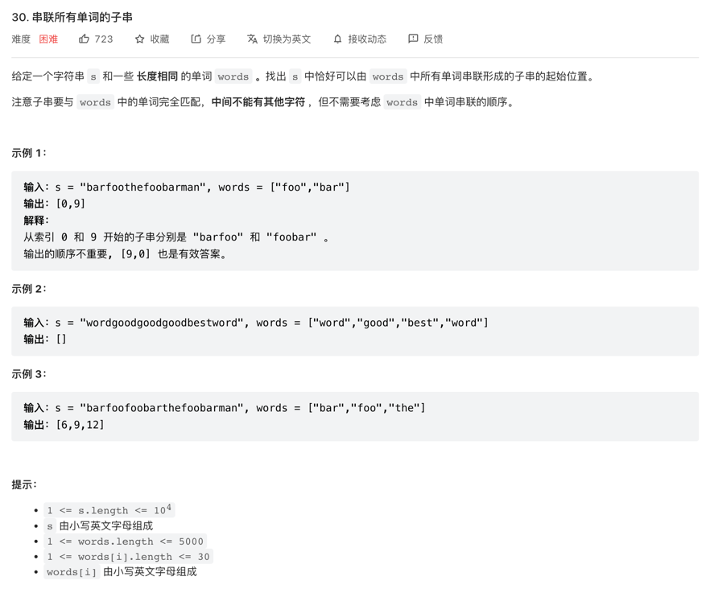

## 30.串联所有单词的子串

### 前提： 设 s长度为n words 长度为 m words[0]长度为 k

### 思路1: 使用hash表存储words里单词出现的次数，然后 循环s
### s => 寻找 [i, i + m * k] 区间窗口内 步进 为 k,截取长度区间[j, j + k]的单词存入另外一个hash表，
### 最后判断两个hash是否相同

### 思路2 窗口归纳: 本质上 循环因子 i 迭代至 i * k时 i*k 与 i 是一样被遍历到的，即i的循环长度可以缩小至单词的长度k
### 不过这个时候第二层循环 j 需要把窗口的终点定到 n - k，然后需要维护位于窗口内的hash池，如果j标记窗口位置到了`i + m * k`，则需要让  `[j - m * k, j - m * k + k]`的单词减少一次，次数为1则直接移除