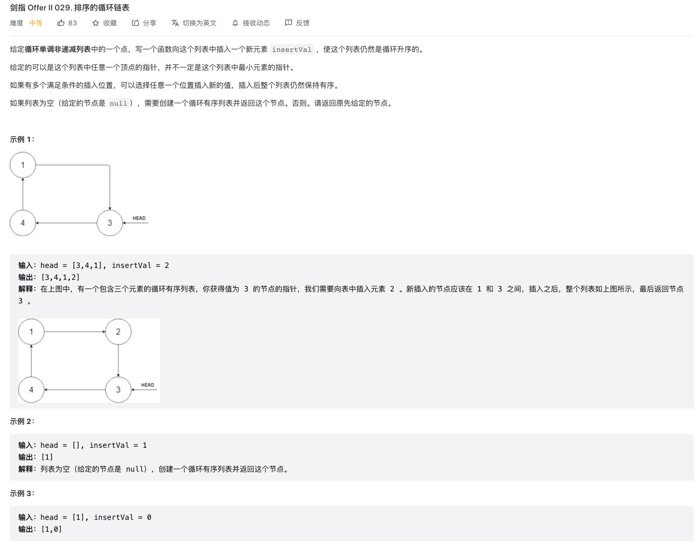

## 剑指 Offer II 029.排序的循环链表

### 链接表题思路比较通透 需要用一个临时 `Node` 去缓存，实现动态获取到`node.next`,本质是地址对引用
### 所以操作 临时 `Node` 也会对原来的node 产生影响

### 思路：
#### 本质就是寻找一个能让其 `inserVal` 插入的地方，因为其是循环单调非递减的，所以可以考虑几种情况：
##### 1. head 本身 为null 则 返回就是 自循环的insertVal 构造的Node
##### 2. `insertValue` >= node.val && `insertValue` <= node.next.val 介于递增区间内
##### 3. `insertValue` 位于循环的尾部，即 node.val > node.next.val,这时 `insertValue` 可以比 node.val 大 或者 比 node.next.val 小，这两种情况都是放到尾部
##### 4. 除了上面的 当 node == node.next 再一次到循环起点时，`insertValue` 只能放入这里了，这里也只有一种可能，`insertValue`比其它人都小