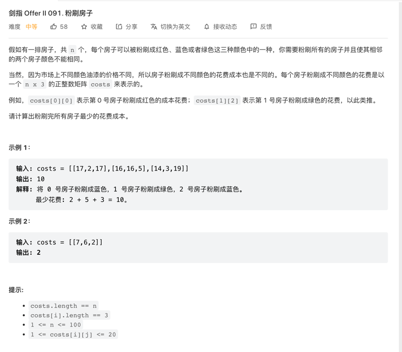

## 剑指 Offer II 091.粉刷房子

## 思路: 看到这种题目第一时间就是 动态规划dp的应用题

### 套用基本dp公式: 
### `dp[i] = Min or Max {dp[i - 1], ...}` 公式内 i 表示所需要求的结果
### 应用到该题，先找到限制条件：
### `1.所有的房子并且使其相邻的两个房子颜色不能相同`
### `2.粉刷完所有房子最少的花费成本`
### 2种限制条件下 dp的逻辑需要变更成二维数组 =>
### `dp[i][j] = Min{dp[i - 1][非j], ...}` 即 表示 在 涂完 i 房子，第 i 间 房子涂 j 颜色 最小的cost

### 所以 只要从i = 0开始循环 求得 d[i][j] 最后比较 d[i] 中 的最小值就可以了

### 这种通用公式统计了 所有的 d[i][j],存下了所有的状态，但其实该题目里 只求 d[i], d[i] 又只受到 d[i - 1] 影响，所以可以改成简单状态机：
### 用 r,g,b 标记 d[i - 1] 的三个变量,每次循环动态替换rgb